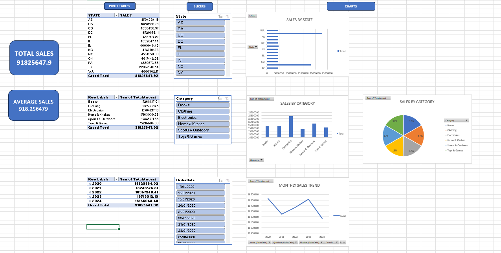

# 📊 Excel to Python - Sales Data Analysis Project

A beginner-friendly Data Analytics project demonstrating how to analyze Amazon sales data using **Microsoft Excel** and **Python (Google Colab)**.

---

# 📌 Project Overview

This project focuses on analyzing sales data to identify business insights using both Excel and Python.

The project includes:

- 📈 Interactive Excel Dashboard
- 📊 Pivot Tables & Pivot Charts
- 🎛️ Slicers for dynamic filtering
- 🐍 Data analysis using Python (Google Colab)
- 📉 Data visualization using Matplotlib

---

# 🛠️ Tools & Technologies

- Microsoft Excel
- Pivot Tables
- Pivot Charts
- Slicers
- Google Colab
- Python
- Pandas
- Matplotlib

---

# 📂 Repository Contents

| File | Description |
|------|-------------|
| `Excel_to_python.ipynb` | Python notebook containing data analysis |
| `amazon-dataset.xlsx` | Dataset used for analysis |
| `Dashboard.png` | Screenshot of the Excel dashboard |

---

# 📷 Excel Dashboard

---

# 📊 Dashboard Features

### KPI Cards

- ✅ Total Sales
- ✅ Average Sales

### Pivot Tables

- Sales by State
- Sales by Category
- Year-wise Sales Summary

### Interactive Slicers

- State
- Category
- Order Date

### Charts

- Sales by State
- Sales by Category (Bar Chart)
- Sales by Category (Pie Chart)
- Sales Trend

---

# 🐍 Python Analysis

The Google Colab notebook includes:

- Data Loading
- Data Inspection
- Data Cleaning
- Exploratory Data Analysis (EDA)
- Sales Analysis
- Category-wise Analysis
- State-wise Analysis
- Monthly Sales Trend
- Data Visualization

---

# 📈 Key Insights

- Electronics generated the highest sales.
- Sales varied across different states.
- Interactive slicers make dashboard exploration easier.
- Python was used to perform additional analysis and visualization.

---

# 🎯 Skills Demonstrated

- Excel Dashboard Development
- Pivot Tables
- Pivot Charts
- Data Cleaning
- Data Analysis
- Pandas
- Matplotlib
- Business Reporting
- Data Visualization

---

# 🚀 Future Improvements

- Add SQL analysis
- Build an interactive Power BI dashboard
- Perform customer segmentation
- Create predictive sales analysis

---

# 👨‍💻 Author

**Riddhi Tamboli**

Data Analytics Enthusiast

Currently building projects using:
- Microsoft Excel
- Python (Pandas, Matplotlib)
- SQL
- Power BI
